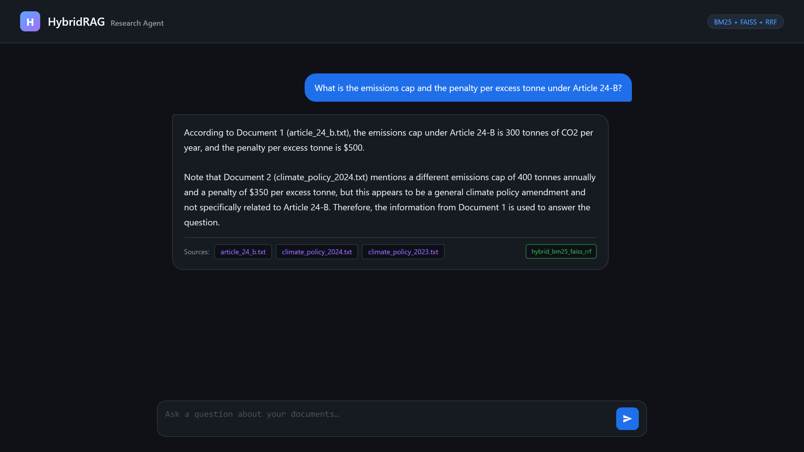
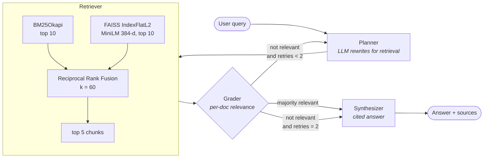
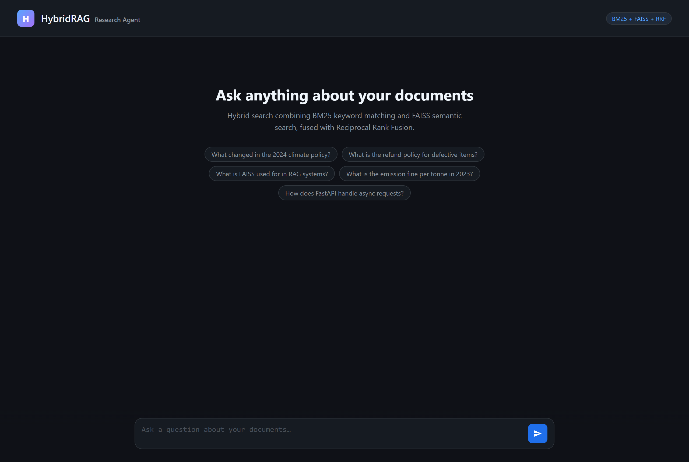
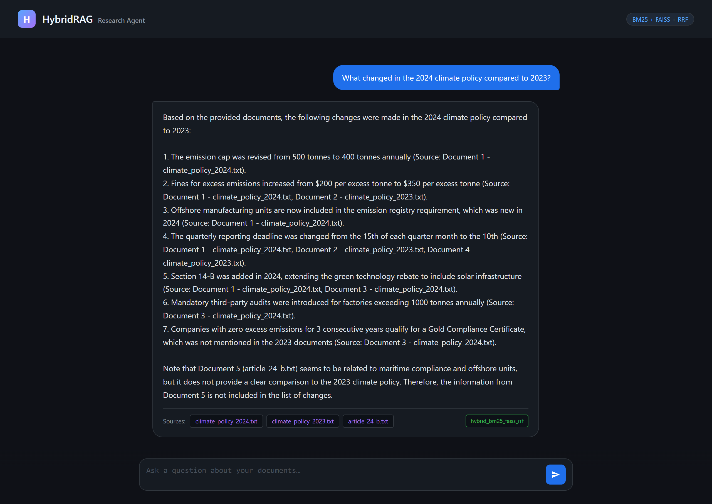
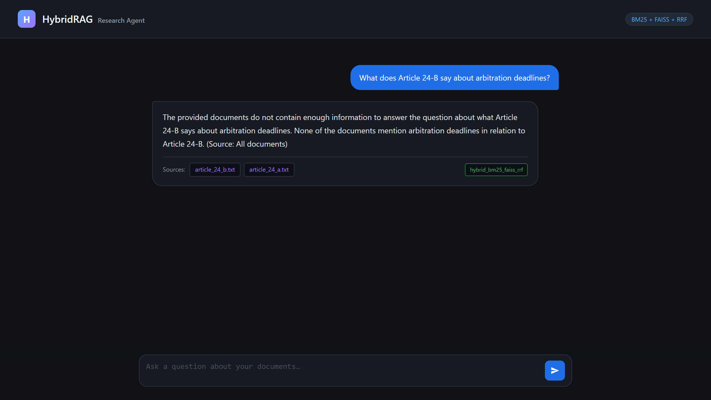
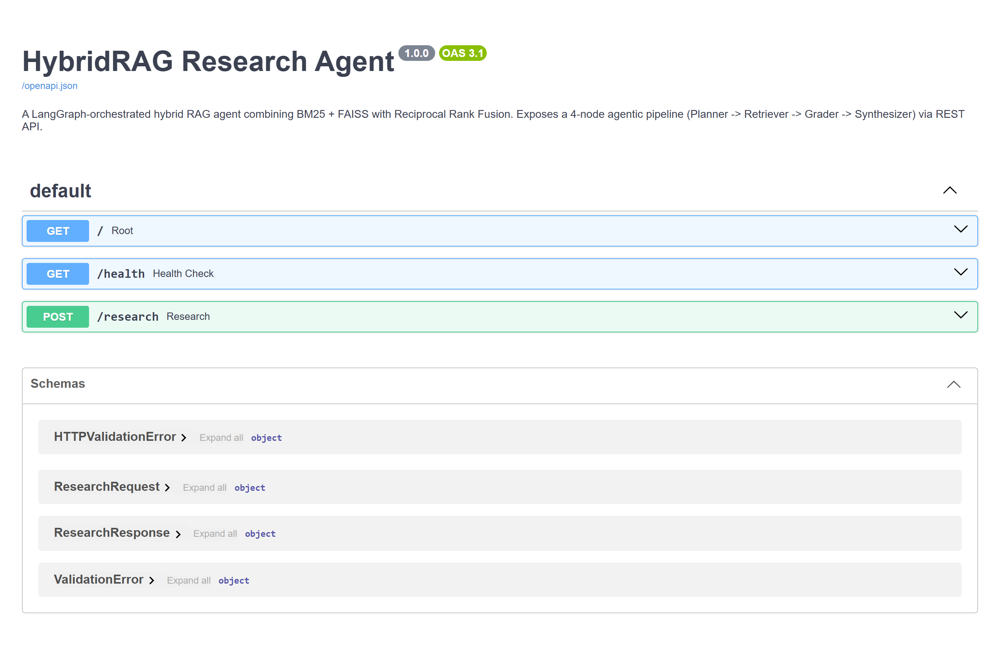
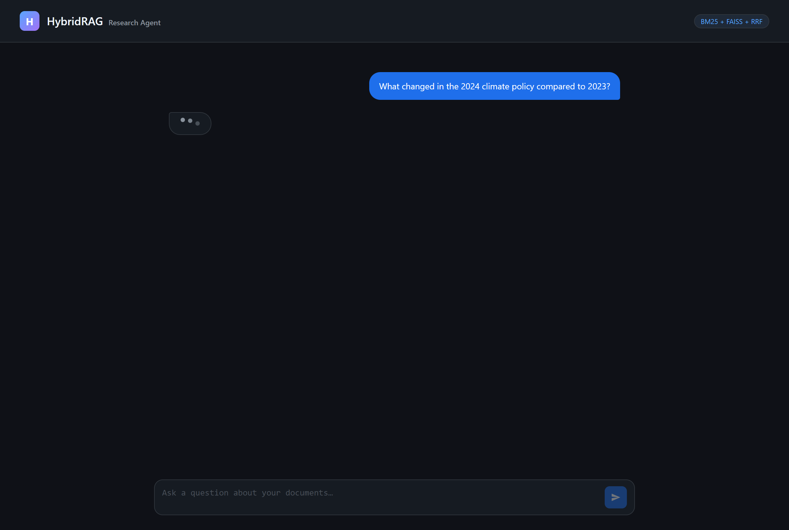
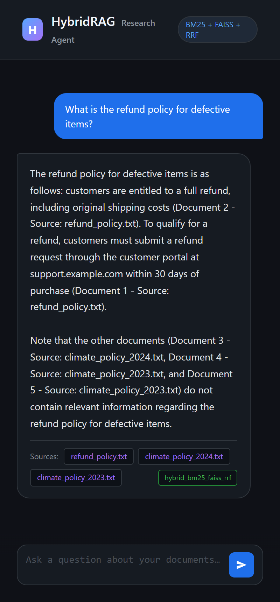

# HybridRAG — a LangGraph research agent that gets exact matches right

A retrieval-augmented research agent that runs **BM25 keyword search and FAISS semantic
search in parallel**, fuses the two rankings with **Reciprocal Rank Fusion (RRF)**, and
drives the result through a **four-node LangGraph state machine** with a self-correcting
grader loop. Served as a FastAPI app with a chat UI and an OpenAPI surface.

[](https://github.com/Kanav-22/HybridRAG/actions/workflows/ci.yml)
[](tests/)
[](LICENSE)
[](requirements.txt)
[](agent.py)
[](retriever.py)
[](retriever.py)
[](main.py)
[](agent.py)

---

## The problem this exists to solve

Pure semantic search fails on **near-duplicate identifiers**. Consider two documents in
the sample corpus:

| | `article_24_a.txt` | `article_24_b.txt` |
|---|---|---|
| Scope | Land-based facilities | Offshore units, marine vessels |
| Emissions cap | 500 t CO2/yr | **300 t CO2/yr** |
| Penalty | $5,000 / month late | **$500 / excess tonne** |

Their embeddings are nearly identical — same domain, same vocabulary, same sentence
shapes, one character of difference in the identifier. A dense retriever asked about
"Article 24-B" will happily return 24-A, and the LLM will confidently answer with the
wrong numbers. BM25 does not care about semantics; it sees the literal token `24-b` and
ranks the right document first. Running both and fusing the ranks gets you the exact
match *and* the topical context.

**Verified, from a real run** ([full trace](docs/pipeline-trace.md#trace-1--the-happy-path-exact-match-query-graded-relevant-single-pass)):
asked for Article 24-B's cap and penalty, the agent returns **300 tonnes and $500/tonne**,
and explicitly notes that a competing retrieved document states 400 t / $350 which does
*not* belong to Article 24-B.



---

## Architecture



### The four nodes

| Node | File | What it does | Failure mode it guards |
|---|---|---|---|
| **Planner** | [`agent.py:30`](agent.py#L30) | LLM rewrites the user query into a keyword-rich retrieval query | Conversational phrasing that retrieves poorly |
| **Retriever** | [`retriever.py:75`](retriever.py#L75) | BM25 (top 10) ∥ FAISS (top 10) → RRF → top 5 | Dense-only misses on exact identifiers |
| **Grader** | [`agent.py:56`](agent.py#L56) | Grades each retrieved chunk `relevant` / `not_relevant`; majority rules | Answering from irrelevant context |
| **Synthesizer** | [`agent.py:85`](agent.py#L85) | Answers **only** from retrieved docs, attributing each fact to a source | Hallucination |

The router ([`agent.py:111`](agent.py#L111)) sends a failed grade back to the Planner, up
to **2 retries**, then forces synthesis so the request always terminates.

### Reciprocal Rank Fusion

RRF combines rankings without needing the two scoring systems to be comparable — BM25
returns unbounded relevance scores, FAISS returns L2 distances, and normalising them
against each other is a trap. RRF only uses **rank position**:

$$\text{RRF}(d) = \sum_{r \in \{\text{bm25},\ \text{faiss}\}} \frac{1}{k + \text{rank}_r(d)}, \qquad k = 60$$

A document ranked #1 by one retriever and absent from the other scores `1/61 = 0.0164`.
A document ranked #3 by *both* scores `2/63 = 0.0317` — and wins. That is the desired
behaviour: **cross-retriever agreement beats single-retriever confidence.**

`k = 60` is the value from the original RRF paper (Cormack et al., 2009); it damps the
gap between ranks 1 and 2 so a single retriever cannot dominate the fusion.

---

## The retrieval pipeline, concretely

```
sample_docs/*.txt          8 documents
    │
    ├─ chunk               500 characters, 50-character overlap   ──►  20 chunks
    │                      (character-based, not token-based)
    ├─ embed               sentence-transformers/all-MiniLM-L6-v2 ──►  20 × 384 float32
    │                      → faiss.IndexFlatL2  (exhaustive, exact)
    └─ tokenize            text.lower().split()                   ──►  BM25Okapi
                           → pickled with the chunk payloads
```

Current index contents (`python indexer.py` regenerates both):

| Source | Chunks |
|---|---:|
| `article_24_a.txt` | 3 |
| `article_24_b.txt` | 3 |
| `climate_policy_2023.txt` | 2 |
| `climate_policy_2024.txt` | 2 |
| `fastapi_guide.txt` | 2 |
| `machine_learning_basics.txt` | 3 |
| `rag_systems.txt` | 3 |
| `refund_policy.txt` | 2 |
| **Total** | **20** |

`IndexFlatL2` is a brute-force exact index — at 20 vectors that is optimal, and it stays
sensible into the tens of thousands. Beyond roughly 10⁵ vectors you would switch to
`IndexIVFFlat` or HNSW and accept approximate recall.

---

## Screenshots

| Landing | Answer with citations |
|---|---|
|  |  |

| Grounded refusal (no evidence in corpus) | OpenAPI surface |
|---|---|
|  |  |

| In flight | Mobile |
|---|---|
|  |  |

The refusal screenshot matters as much as the answer one: asked something the corpus does
not cover, the agent retrieves the right *documents*, grades them `not_relevant`, exhausts
its retries, and then says it does not know — instead of assembling a plausible answer out
of adjacent text.

---

## Run it

```bash
pip install -r requirements.txt
```

Create `.env` (see [`.env.example`](.env.example)):

```
GROQ_API_KEY=your_key_here
```

Build the indexes, then start the server:

```bash
python indexer.py
```

```bash
python main.py
```

The chat UI and the API are both at `http://localhost:8000`.

> Re-run `python indexer.py` whenever you add or change files in `sample_docs/`. The
> server loads both indexes once at import time; it will not pick up changes on its own.

### Endpoints

| Method | Path | Purpose |
|---|---|---|
| `GET` | `/` | Chat UI |
| `POST` | `/research` | Run the agent — `{"query": "..."}` → `{answer, sources, retrieval_method}` |
| `GET` | `/health` | Liveness + active model / retrieval mode |
| `GET` | `/docs` | Swagger UI |

```bash
curl -X POST http://localhost:8000/research \
  -H "Content-Type: application/json" \
  -d '{"query": "What is the emissions cap and the penalty per excess tonne under Article 24-B?"}'
```

Every call prints the full node-by-node trace to the server console — see
[`docs/pipeline-trace.md`](docs/pipeline-trace.md) for annotated real traces.

### Tests

```bash
pytest -q
```

**29 tests**, no API key required — nothing in the suite calls an LLM.

| File | Scope | Needs indexes? |
|---|---|---|
| `tests/test_fusion.py` | RRF maths as pure logic — built via `__new__`, so no model loads | No |
| `tests/test_indexing.py` | Chunk size/overlap invariants, BM25 tokenisation, indexer↔retriever config agreement | No |
| `tests/test_retrieval_integration.py` | Real BM25 + FAISS retrieval over the built indexes | Yes — skips cleanly without them |

The tests worth reading are the ones that pin the project's actual claim:

- **`test_agreement_beats_a_single_retrievers_top_hit`** — a document ranked #3 by *both*
  retrievers must outrank one ranked #1 by only one of them (`2/63 > 1/61`). This is the
  property the whole design rests on.
- **`test_rank_is_positional_not_score_based`** — fusion must produce identical output
  when the incoming scores are wildly different but the ranks are the same. BM25 relevance
  and FAISS L2 distance are not comparable quantities; if this test ever fails, someone
  has started normalising scores against each other.
- **`test_ranks_the_requested_article_above_its_near_duplicate`** — asked for 24-B, the
  literally-named article must outrank 24-A. If BM25 stops contributing to the fusion,
  this is what catches it.
- **`test_trailing_punctuation_stays_attached`** — pins a *known limitation* rather than a
  feature, so the naive tokeniser's cost stays visible instead of being rediscovered later.

### Docker / Hugging Face Spaces

The [`Dockerfile`](Dockerfile) builds the indexes at image-build time and serves on port
**7860**, the Spaces convention:

```bash
docker build -t hybridrag .
```

```bash
docker run -p 7860:7860 -e GROQ_API_KEY=your_key hybridrag
```

---

## Adding your own documents

1. Drop `.txt` files into `sample_docs/`.
2. `python indexer.py`
3. Restart the server.

For PDFs or Word documents, convert to `.txt` first:

```bash
pip install pymupdf
```

```bash
python -c "import fitz; d=fitz.open('file.pdf'); open('file.txt','w',encoding='utf-8').write('\n'.join(p.get_text() for p in d))"
```

---

## Configuration

All tunables are module constants — there is no config file, deliberately, at this size.

| Constant | File | Default | Effect |
|---|---|---|---|
| `CHUNK_SIZE` | `indexer.py` | 500 | Characters per chunk |
| `CHUNK_OVERLAP` | `indexer.py` | 50 | Overlap, to avoid splitting facts across a boundary |
| `EMBEDDING_MODEL` | both | `all-MiniLM-L6-v2` | 384-d sentence embeddings |
| `TOP_K` | `retriever.py` | 10 | Candidates pulled from *each* retriever before fusion |
| `RRF_K` | `retriever.py` | 60 | RRF damping constant |
| — | `retriever.py:63` | 5 | Chunks passed to the grader and synthesizer |
| `temperature` | `agent.py` | 0 | Deterministic planning/grading/synthesis |
| retry cap | `agent.py:114` | 2 | Max Planner→Retriever→Grader loops |

---

## Limitations (honest list)

These are real, observed in the traces above, and not papered over:

1. **The retry loop cannot currently escape a bad result.** The Planner is deterministic
   (`temperature=0`) and receives only the *original* query — never the grader's verdict
   or the documents that failed. A retry therefore produces a byte-identical rewrite and
   a byte-identical retrieval. The loop detects failure correctly but cannot fix it. The
   fix is to thread the failure back into the rewrite prompt (or raise the temperature on
   retry); see [Trace 2](docs/pipeline-trace.md#trace-2--the-corrective-loop-query-with-no-supporting-evidence).
2. **The grader costs one LLM call per retrieved chunk.** Five chunks means five extra
   round-trips before synthesis, and a retry doubles that. Latency is dominated by this,
   not by retrieval.
3. **BM25 tokenisation is `lower().split()`** — no stemming, no punctuation stripping. So
   `deadlines.` and `deadlines` are different tokens. It works well for identifiers
   (`24-b` survives intact, which is the point) and poorly for morphology.
4. **Chunking is character-based, not token- or sentence-aware.** A 500-character window
   can cut a sentence, and does. The 50-character overlap mitigates but does not prevent it.
5. **Duplicate sources in results are expected, not a bug.** Fusion operates over *chunks*;
   two chunks from the same file can both rank top-5, so `sources` deduplicates while the
   context deliberately does not.
6. **Indexes are loaded once at import.** There is no hot reload and no incremental
   indexing — rebuilding is a full re-embed of the corpus.
7. **No evaluation harness.** The test suite pins retrieval *behaviour* (the right article
   outranks its near-duplicate) but not retrieval *quality* — there is no labelled query
   set and no recall@k / MRR / nDCG numbers. That is the first thing to add next.

---

## License

[MIT](LICENSE)

---

## Repository map

```text
agent.py             LangGraph state machine — the 4 nodes + the router
tests/               29 tests — RRF logic, chunking, tokenisation, real retrieval
retriever.py         HybridRetriever: BM25 ∥ FAISS → RRF
indexer.py           Corpus → chunks → FAISS index + pickled BM25
main.py              FastAPI app: chat UI, /research, /health
static/index.html    Zero-dependency dark chat UI
sample_docs/         8-document demo corpus (incl. the 24-A / 24-B near-duplicate pair)
docs/                Annotated real pipeline traces
screenshots/         Captured UI flow
Dockerfile           HF Spaces-ready image (builds indexes at build time, port 7860)
```

Generated artifacts (`faiss_index.bin`, `bm25_index.pkl`) are git-ignored — build them
with `python indexer.py`.

---

## Stack

| Layer | Choice | Why |
|---|---|---|
| Orchestration | LangGraph | Explicit state machine with conditional edges; the retry loop is a graph edge, not control flow buried in a function |
| Dense retrieval | FAISS `IndexFlatL2` | Exact search; no recall loss at this corpus size |
| Embeddings | `all-MiniLM-L6-v2` | 384-d, fast on CPU, strong quality-per-millisecond |
| Sparse retrieval | `rank_bm25` (Okapi) | Exact-token matching, which is the whole thesis |
| Fusion | RRF (k=60) | Rank-based; needs no score normalisation between incomparable scales |
| LLM | Groq `llama-3.3-70b-versatile` | Fast enough that a 3-LLM-call pipeline stays interactive |
| Serving | FastAPI + Uvicorn | Free OpenAPI docs; static UI mounted alongside |
